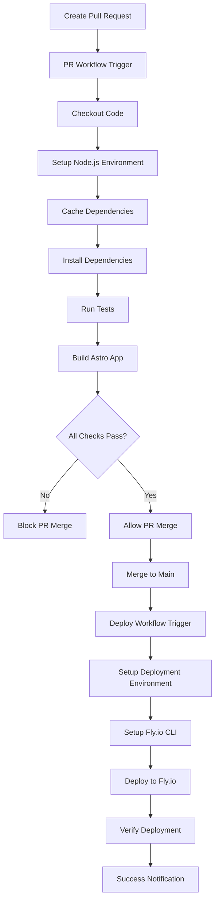

# Design Document

## Overview

This design implements an automated deployment pipeline for the Astro portfolio website to Fly.io using GitHub Actions. The solution provides a complete CI/CD workflow with two separate workflows: a PR validation workflow that runs tests and builds on pull requests, and a deployment workflow that deploys to Fly.io when PRs are merged to main.

The deployment architecture follows modern DevOps practices with proper branch protection, secret management, caching for performance, and comprehensive error handling. The workflow is designed to be maintainable, secure, and efficient.

## Architecture

### Deployment Flow



### Infrastructure Components

1. **PR Validation Workflow**: Tests and builds on pull requests
2. **Deployment Workflow**: Deploys to Fly.io on main branch merges
3. **Branch Protection Rules**: Enforces PR workflow completion before merge
4. **Fly.io Application**: Hosts the deployed Astro application
5. **Docker Container**: Packages the application for deployment
6. **GitHub Secrets**: Stores sensitive configuration securely

## Components and Interfaces

### PR Validation Workflow

**File**: `.github/workflows/pr-validation.yml`

**Responsibilities**:
- Trigger on pull request creation and updates
- Set up Node.js environment with caching
- Install dependencies and run comprehensive tests
- Build the Astro application to verify production readiness
- Report status back to GitHub for branch protection

**Key Steps**:
1. Environment setup with Node.js 18.x
2. Dependency caching using actions/cache
3. Test suite execution (unit, accessibility, visual, performance)
4. TypeScript checking and build verification
5. Status reporting for branch protection rules

### Deployment Workflow

**File**: `.github/workflows/deploy.yml`

**Responsibilities**:
- Trigger on merge to main branch
- Set up deployment environment
- Deploy to Fly.io using official CLI
- Verify deployment success
- Handle deployment failures gracefully

**Key Steps**:
1. Environment setup for deployment
2. Fly.io CLI installation and authentication
3. Application deployment with health checks
4. Post-deployment verification
5. Notification of deployment status

### Fly.io Configuration

**File**: `fly.toml`

**Responsibilities**:
- Define application configuration for Fly.io
- Specify build and deployment settings
- Configure health checks and scaling
- Set environment variables and ports

**Key Configuration**:
- Node.js runtime environment
- Static file serving for Astro build output
- Health check endpoints
- Port and service configuration

### Dockerfile

**File**: `Dockerfile`

**Responsibilities**:
- Create optimized container image
- Install production dependencies
- Serve built Astro application
- Configure runtime environment

**Optimization Features**:
- Multi-stage build for smaller image size
- Node.js Alpine base for security
- Proper layer caching
- Non-root user execution

### Package.json Scripts

**Enhanced Scripts**:
- `build:production`: Optimized build for deployment
- `start:production`: Production server startup
- `deploy:prepare`: Pre-deployment preparation

## Data Models

### GitHub Secrets Configuration

```typescript
interface GitHubSecrets {
  FLY_API_TOKEN: string;        // Fly.io authentication token
  FLY_APP_NAME?: string;        // Optional app name override
}
```

### Fly.io Application Configuration

```toml
# fly.toml structure
[app]
name = "portfolio-app"
primary_region = "sea"

[build]
dockerfile = "Dockerfile"

[http_service]
internal_port = 3000
force_https = true
auto_stop_machines = true
auto_start_machines = true
min_machines_running = 0

[[http_service.checks]]
grace_period = "10s"
interval = "30s"
method = "GET"
timeout = "5s"
path = "/"
```

### Environment Variables

```typescript
interface DeploymentEnvironment {
  NODE_ENV: 'production';
  PORT: number;
  HOST: string;
}
```

## Error Handling

### Build Failures

- **Test Failures**: Workflow stops immediately, preventing bad deployments
- **Build Errors**: Clear error messages with build logs
- **Dependency Issues**: Retry mechanism for transient failures

### Deployment Failures

- **Authentication Errors**: Clear messaging about token configuration
- **Fly.io Service Issues**: Retry with exponential backoff
- **Health Check Failures**: Automatic rollback to previous version

### Monitoring and Alerts

- **GitHub Status Checks**: Visual indicators on commits and PRs
- **Deployment Logs**: Comprehensive logging for troubleshooting
- **Failure Notifications**: GitHub notifications for deployment issues

## Testing Strategy

### Pre-Deployment Testing

1. **Unit Tests**: Run existing Vitest test suite
2. **Build Verification**: Ensure production build completes successfully
3. **Static Analysis**: TypeScript checking and linting

### Post-Deployment Verification

1. **Health Checks**: Automated endpoint verification
2. **Smoke Tests**: Basic functionality validation
3. **Performance Monitoring**: Response time and availability checks

### Rollback Strategy

- **Automatic Rollback**: On health check failures
- **Manual Rollback**: Via Fly.io CLI or dashboard
- **Version Tracking**: Git SHA-based deployment tracking

## Security Considerations

### Secret Management

- **GitHub Secrets**: Encrypted storage of sensitive tokens
- **Principle of Least Privilege**: Minimal required permissions
- **Token Rotation**: Regular API token updates

### Container Security

- **Alpine Linux Base**: Minimal attack surface
- **Non-root User**: Application runs with limited privileges
- **Dependency Scanning**: Automated vulnerability detection

### Network Security

- **HTTPS Enforcement**: Force SSL/TLS for all connections
- **Security Headers**: Proper HTTP security headers
- **CORS Configuration**: Appropriate cross-origin policies

## Performance Optimizations

### Build Performance

- **Dependency Caching**: GitHub Actions cache for node_modules
- **Incremental Builds**: Only rebuild changed components
- **Parallel Processing**: Concurrent test and build steps where possible

### Runtime Performance

- **Static Asset Optimization**: Pre-compressed assets
- **CDN Integration**: Fly.io edge caching
- **Container Optimization**: Minimal runtime dependencies

### Deployment Speed

- **Docker Layer Caching**: Optimize Dockerfile for layer reuse
- **Regional Deployment**: Deploy to optimal geographic regions
- **Health Check Tuning**: Balanced between speed and reliability